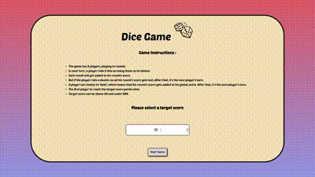
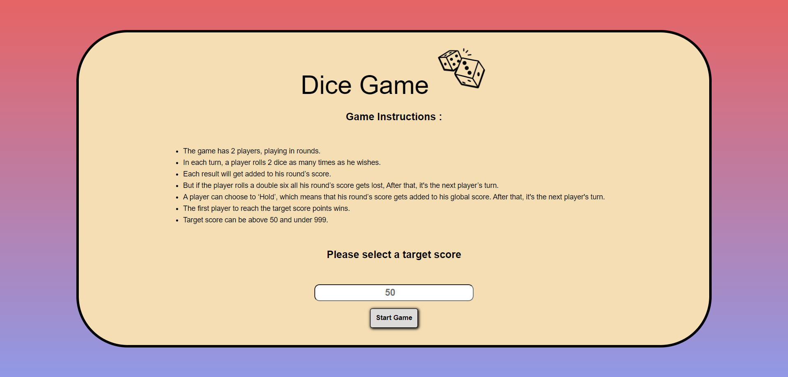
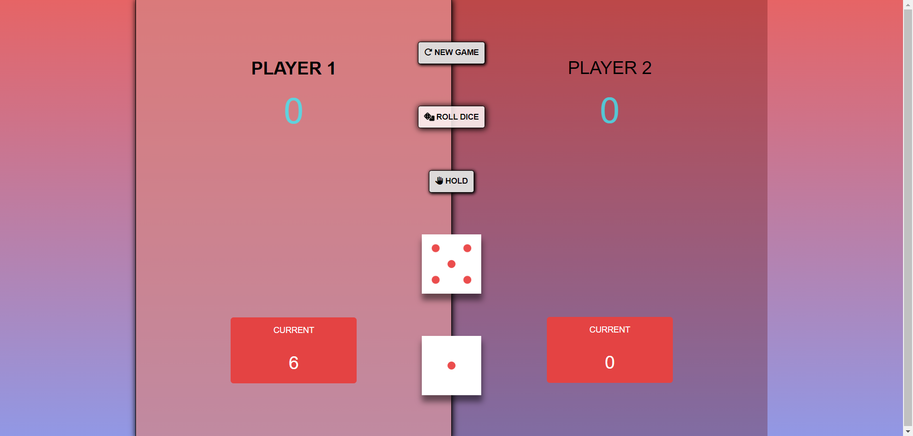

# Dice Game 

Welcome to the Dice Game! This project is a simple yet exciting game where players take turns rolling dice and holding their scores. The first player to reach the target score wins the game.

## Table of Contents
- [Introduction](#introduction)
- [Features](#features)
- [Technology Stack](#technology-stack)
- [Installation](#installation)
- [Usage](#usage)
- [Netlify Deployment](#netlify-deployment)
- [Game Controls](#game-controls)
- [Screenshots](#screenshots)
- [Conclusion](#conclusion)

## Introduction

This Dice Game is a web-based game built with React. The game is designed to be modular and scalable, making it easy to understand and extend. Players take turns to roll two dice and accumulate their scores. They can choose to hold their current score, adding it to their total score. The first player to reach or exceed the target score wins.

## Features

- **Modular Design**: The project is divided into different components, making it easy to manage and extend.
- **Sound Effects**: Enjoy sound effects when rolling the dice and when a player wins.
- **Responsive UI**: The game has a user-friendly interface that works well on various devices.
- **Dynamic Score Updates**: Scores are updated in real-time as players roll the dice and hold their scores.

## Technology Stack

- **React**: JavaScript library for building user interfaces.
- **JavaScript (ES6+)**: The core language used for game logic and interactivity.
- **HTML5**: Markup language used for the game structure.
- **CSS3**: Styling language used for the game’s appearance.
- **Modules**: The project uses ES6 modules to organize code into reusable components.

## Installation

To get a local copy up and running, follow these steps:

1. Clone the repository:
   `git clone https://github.com/DanielYehezkely/dice-game-react`
2. Navigate to the project directory:
   `cd dice-game-react`
3. Install the dependencies:
   `npm install`
4. Start the development server:
   `npm start`
5. Open `http://localhost:3000` in your web browser to start the game.

## Usage

1. Run the development server using `npm start`.
2. Open `http://localhost:3000` in your web browser to start the game.
3. The game interface will appear, allowing players to start a new game, roll dice, hold their scores, and see the winner announcement.

## Netlify Deployment

You can play the Dice Game live on Netlify. Click the link below to start playing:

[Play Dice Game on Netlify](https://dyz-dice-game-react.netlify.app/)

## Game Controls

- **New Game**: Click the "New Game" button to restart the game.
- **Roll Dice**: Click the "Roll Dice" button to roll the dice.
- **Hold**: Click the "Hold" button to hold your current score and switch to the next player.

## Screenshots

*Game Start Screen*

*Player Rolling Dice*

## Conclusion

This Dice Game project showcases how to create a simple, interactive web-based game using React and a modular approach. The modular design ensures that each part of the game is self-contained and easy to manage, making the codebase clean and maintainable.

Feel free to fork the repository and extend the game with more features or improve the existing ones. Happy coding!
